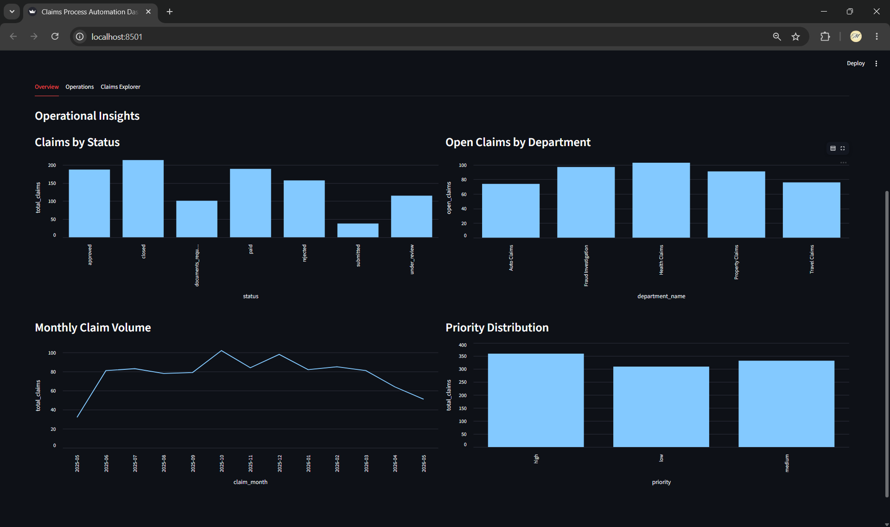
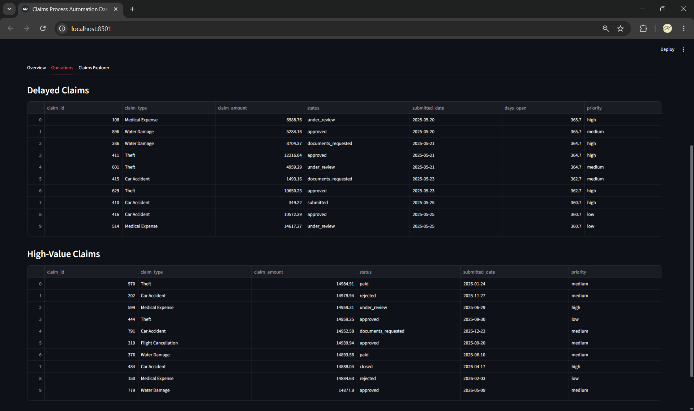
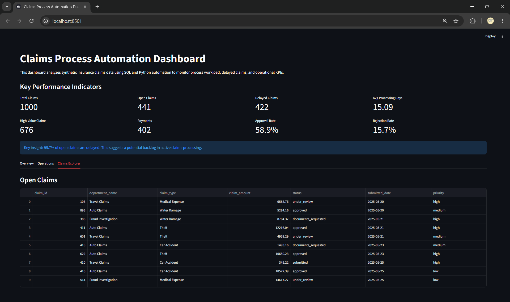

# Claims Process Automation Dashboard

An end-to-end **SQL + Python automation project** that simulates an insurance claims processing workflow using **SQLite, SQL analytics, automated reporting, and Streamlit dashboards**.

The project generates synthetic insurance claims data, automates KPI analysis through modular SQL queries, exports reports to Excel, and visualizes operational insights in an interactive dashboard.

---

## Project Overview

Insurance companies process thousands of claims across departments such as:

- Auto Claims
- Health Claims
- Property Claims
- Travel Claims
- Fraud Investigation

Monitoring claim status, delays, department workload, approvals, and high-value claims is critical for operational efficiency.

This project demonstrates a complete analytics pipeline:

**Synthetic Data → SQLite Database → SQL Analytics → Excel Reports → Interactive Dashboard**

---

## Features

### Data Generation
- Generate synthetic insurance claims data using **Python + Faker**
- Simulates:
  - Customers
  - Claims
  - Claim events/history
  - Payments
  - Department workload

### SQL Analytics
Reusable SQL query system for:

- Claims by status
- Open claims
- Delayed claims
- Monthly claim volume
- Approval & rejection rates
- High-value claims
- Priority distribution
- Department workload
- KPI row counts

### Reporting Automation
- Automatically executes SQL queries
- Exports analytics into a multi-sheet Excel report

### Interactive Dashboard
Built using **Streamlit** with:

- KPI cards
- Business insight summaries
- Interactive tabs
- Operational charts
- Claims explorer tables

---

# Dashboard Preview

The dashboard contains a KPI section visible across all tabs and three analytical views for operational monitoring and claim exploration.

---

## KPI Dashboard (Visible Across All Tabs)

The top section provides key operational metrics:

- Total claims
- Open claims
- Delayed claims
- Average processing days
- High-value claims
- Payments
- Approval rate
- Rejection rate

It also includes a business insight summary to highlight operational bottlenecks.

---

## Overview Tab

The **Overview** tab provides operational analytics and visual insights through charts.

Includes:

- Claims by status
- Open claims by department
- Monthly claim volume
- Priority distribution



---

## Operations Tab

The **Operations** tab focuses on claims processing monitoring.

Includes:

- Delayed claims table
- High-value claims table



---

## Claims Explorer Tab

The **Claims Explorer** tab enables claim-level exploration.

Includes:

- Open claims table



---

## Tech Stack

### Languages & Data
- Python
- SQL
- SQLite
- Pandas
- Faker

### Dashboard & Visualization
- Streamlit

### Environment Management
- uv

---

## Project Structure

```text
claims-process-automation/
│
├── app/
│   └── streamlit_app.py         # Streamlit dashboard
│
├── assets/screenshots/          # Dashboard screenshots
│
├── data/
│   ├── claims.db                # SQLite database
│   └── reports/                 # Excel KPI reports
│
├── docs/
│   └── business_process.md
│
├── sql/
│   ├── queries/                 # Modular SQL KPI queries
│   ├── schema.sql               # Database schema
│   └── analysis_queries.sql
│
├── src/claims_automation/
│   ├── config.py
│   ├── database.py              # Create database
│   ├── generate_data.py         # Generate synthetic data
│   ├── query_manager.py         # SQL execution
│   └── run_analysis.py          # Export Excel KPI reports
│
├── pyproject.toml
├── uv.lock
└── README.md
```

### Folder Explanation

- **`app/`** → Streamlit dashboard UI  
- **`sql/queries/`** → Modular SQL KPI queries  
- **`data/`** → SQLite database and exported reports  
- **`src/claims_automation/`** → Python automation pipeline  
- **`assets/screenshots/`** → README dashboard images  
- **`docs/`** → Business process documentation  

---

# How to Run the Project

## 1. Clone Repository

```bash
git clone <your-repository-url>
cd claims-process-automation
```

---

## 2. Install Dependencies

Using `uv`:

```bash
uv sync
```

Activate environment.

### Windows

```powershell
.venv\Scripts\activate
```

### Mac/Linux

```bash
source .venv/bin/activate
```

---

## 3. Create Database

Run:

```bash
uv run python -m claims_automation.database
```

This creates:

```text
data/claims.db
```

using:

```text
sql/schema.sql
```

---

## 4. Generate Synthetic Data

Run:

```bash
uv run python -m claims_automation.generate_data
```

This generates synthetic:

- Customers
- Claims
- Claim events
- Payments

and inserts them into SQLite.

---

## 5. Run SQL Analysis Pipeline

Run:

```bash
uv run python -m claims_automation.run_analysis
```

This will:

- Execute all SQL queries
- Generate KPI outputs
- Export an Excel report

Output:

```text
data/reports/claims_kpi_report.xlsx
```

---

## 6. Launch Dashboard

Run:

```bash
uv run streamlit run app/streamlit_app.py
```

Open:

```text
http://localhost:8501
```

---

## Example KPIs

The dashboard tracks:

- Total claims
- Open claims
- Delayed claims
- Approval rate
- Rejection rate
- Average processing days
- Department workload
- Monthly claim volume
- High-value claims

Example business insight:

> ~96% of open claims are delayed, indicating a potential claims processing backlog.

---

## Notes

- Synthetic data is generated automatically using **Faker**.
- SQL analytics are modularized into reusable `.sql` files.
- Dashboard outputs may vary depending on generated synthetic data (unless a fixed seed is used).

---

## Future Improvements

Potential extensions:

- Filters by department/status/priority
- Interactive search
- Docker deployment
- Automated tests
- CI/CD pipeline
- Real-time data refresh
- More realistic claims workflows

---

## Author

**Mrudula Ankush Ingale**

M.Sc. Computer Science | Data Science & Machine Learning

Interested in:
- Machine Learning
- Data Analytics
- SQL Automation
- Data Engineering
- AI Applications
